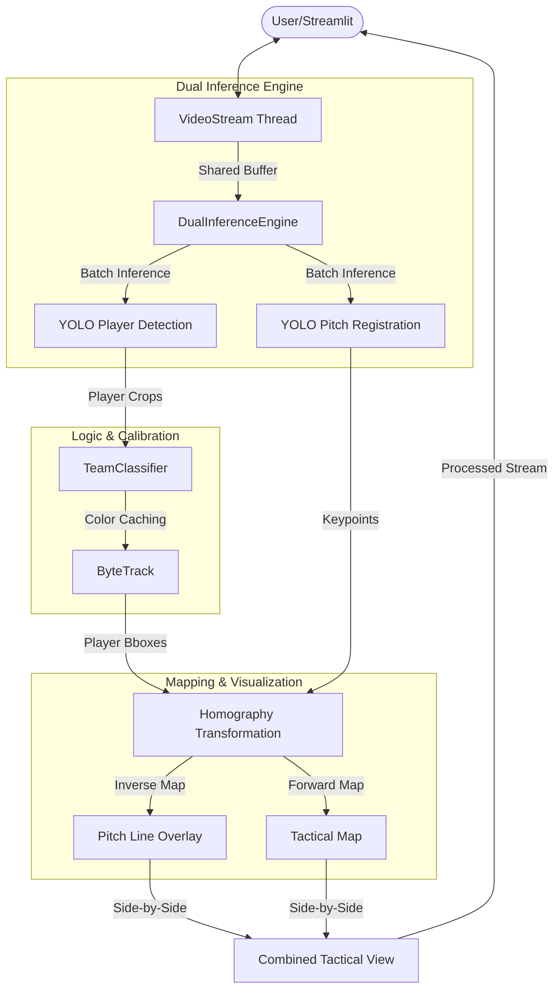

# Football AI CV Pipeline: Architecture Overview

This document provides a detailed explanation of the application's architecture, from the high-throughput video intake to the 2D tactical mapping and real-time visualization systems.

---

## 🏗️ High-Level System Architecture

The application is built for high-performance, real-time computer vision using a **Producer-Consumer** pattern to decouple video I/O from heavy neural network inference.

---

## 🌐 1. Processing Pipeline & I/O

The backbone of the system is designed for maximum throughput using multi-threading and GPU acceleration.

- **VideoStream**: A dedicated thread continuously buffers incoming video frames. This prevents slow disk I/O from stalling the GPU during inference.
- **DualInferenceEngine**: Instead of sequential processing, the system initializes both the Player Detection and Pitch Registration models as a unified engine. 
- **TensorRT Support**: The pipeline supports `.engine` (TensorRT) format, which allows for significantly higher FPS by optimizing the model for the specific local hardware.

---

## 🤖 2. Model Interaction & Team Intelligence

The core intelligence has been upgraded to handle dynamic game conditions without manual configuration.

### A. Dual Engine Inference
- **Player Detection**: identifies players, referees, and the ball.
- **Pitch Registration**: Detects specific field keypoints (corners, penalty spots, line intersections) to understand the 3D perspective.
- **Latency Management**: The system can perform **Frame Skipping**. In high-speed modes, the models run every N frames, while the intermediate frames reuse the previous geometric transformation to maintain high visual output speed.

### B. Dynamic Team Classification (`TeamClassifier`)
The system no longer requires hardcoded team colors.
- **Rolling Calibration**: During the first 10-15 frames of any video, the pipeline "fits" a classification model to the identified players.
- **Player Registry**: Once calibrated, player IDs are cached in a registry. This ensures that even if a tracker skips a frame, the player's team identity remains stable.

---

## 🗺️ 3. 2D Mapping & Augmented Vision (Homography)

We utilize **Two-Way Homography** to bridge the gap between the 3D broadcast view and the 2D tactical map.

### Forward Mapping (3D → 2D)
Maps the feet of every player to a precise $(x, y)$ coordinate on a flat 105m x 68m FIFA pitch representation. This powers the **Tactical Minimap**.

### Inverse Mapping (2D → 3D)
The system projects the "ideal" pitch lines from the 2D template back onto the original video frame. This creates an **Augmented Reality** effect where the detected pitch boundaries are visually confirmed by blue/green outlines on the actual grass.

---

## ⚡ 4. Performance & Optimization Layers

To achieve real-time performance, the architecture implements several optimization strategies:

1. **Producer Pattern**: Threaded frame capture decouples CPU tasks from GPU inference.
2. **Resolution Scaling**: The input `imgsz` is tunable to balance speed and accuracy (standard: 640px).
3. **Hardware Acceleration**: Full suite of CUDA and TensorRT integration.
4. **Interpolation**: The system reuses Homography matrices between frames to reduce the computational cost of recalculating the perspective for every single frame.

---

## 🔄 Data Flow Summary

1. **Capture**: `VideoStream` threads capture frames into a buffer.
2. **Inference**: `DualInferenceEngine` runs detections and keypoint extraction.
3. **Logic**: `TeamClassifier` identifies teams; `ByteTrack` maintains player identities.
4. **Geospatial**: `Homography` maps 3D points to 2D tactical coordinates.
5. **Output**: side-by-side view showing the annotated action and the live tactical map.

